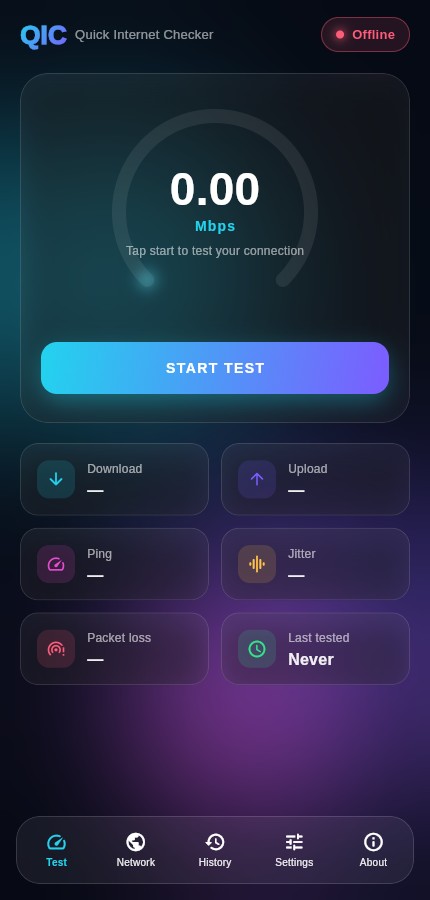
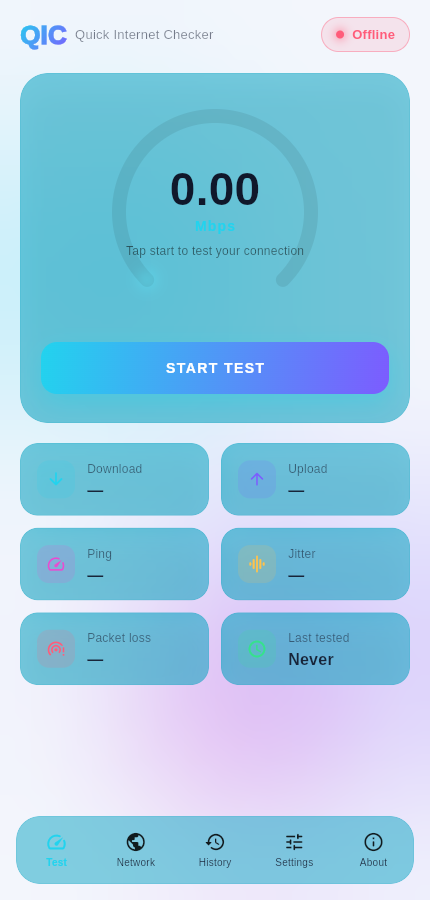

# QIC — Quick Internet Checker

QIC tests your internet connection — speed, availability, latency, DNS
health, and public IP/ISP details — from one Flutter codebase that runs on
**Android, web, Windows, macOS, and Linux**.

<p align="center">
  
  
</p>

## Features

- **Speed test** — download & upload throughput via Cloudflare's public
  speed-test endpoints, with a live-updating animated gauge.
- **Ping, jitter & packet loss** — measured across repeated probes during
  every test run.
- **Availability check** — a real reachability probe (not just "is Wi-Fi
  connected"), shown as a glowing Online/Offline status pill.
- **Network info** — public IP address, ISP, approximate location, and
  latency to major networks (Cloudflare, Google, Amazon, Microsoft).
- **DNS resolution timing** — how long it takes to resolve a domain (native
  platforms; browsers don't expose raw DNS timing).
- **History** — every test result saved locally, with a download-speed
  trend sparkline.
- **Settings** — light/dark/system theme, Mbps/MB·s toggle.
- Self-contained: bundles its own font and its own CanvasKit runtime, so it
  never depends on a third-party CDN to render.

## Tech stack

- [Flutter](https://flutter.dev) (Dart) — single codebase for every platform
- [Cloudflare speed test endpoints](https://speed.cloudflare.com) for
  download/upload measurement
- [ipapi.co](https://ipapi.co) for public IP/ISP lookups
- `connectivity_plus`, `shared_preferences`, `http`, `intl`

## Getting started

```bash
flutter pub get
flutter run              # run on a connected device/emulator or Chrome
flutter build apk         # Android
flutter build web         # Web
flutter build windows     # Windows
flutter build macos       # macOS
flutter build linux       # Linux
```

## Download

A signed-off, ready-to-install **Android APK** is published automatically
on every push to `main` — grab the latest one from this repo's
[Releases page](../../releases).

## Project structure

```
lib/
  models/       Data classes (speed samples, ping results, IP info)
  services/     Network probing, local history, settings persistence
  theme/        Brand colors and light/dark ThemeData
  widgets/      Reusable UI: glass cards, gradient background, gauge, sparkline
  screens/      Home, Network Info, History, Settings, About
```

## License

See [LICENSE](LICENSE). This is source-available, not open-source: you may
download and run builds of this app, but modification and redistribution
require permission from the copyright holder.
